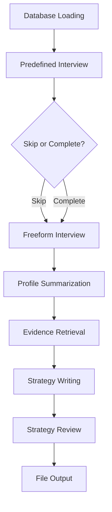

# RAG MVP - Responsible AI Strategy Generator

This project implements a comprehensive Retrieval Augmented Generation (RAG) system that conducts interactive interviews and generates personalized Responsible AI strategies. The system features a sophisticated orchestration pipeline using LangGraph, structured outputs with Pydantic validation, and robust error handling.

## 🎯 **Key Features**

- **🗣️ Interactive Interview System**: Two-stage interview (predefined + freeform questions)
- **🔍 RAG-based Strategy Generation**: Uses MIT AI Risks database and research papers
- **📋 Structured Outputs**: Pydantic schemas ensure reliable JSON responses
- **🛡️ Robust Error Handling**: Comprehensive fallbacks and timeout protection
- **⚙️ YAML Configuration**: Centralized prompt management
- **📁 Automated File Output**: Saves strategies with timestamps and metadata
- **🚫 Skip Functionality**: Users can skip to freeform interview anytime

## 📁 **Project Structure**

```
RAG_MVP/
├── main.py                    # 🚀 Main orchestration file
├── rag_graph.py              # 📊 Original graph implementation
├── ingestion_pipeline.py     # 📚 Data loading and processing
├── requirements.txt          # 📦 All dependencies
├── configurations/           
│   └── prompts.yaml          # 💬 Centralized prompt templates
├── papers/                   # 📄 PDF research papers
├── vector_store/             # 🗄️ ChromaDB vector database
├── output/                   # 📋 Generated strategy files
├── .env                      # 🔐 Environment variables (create this)
└── README.md                 # 📖 This file
```

## 🔧 **Prerequisites**

- **Python**: 3.10 or higher
- **OpenAI API Key**: For GPT-4o-mini access
- **Internet Connection**: For database loading and API calls

## 🚀 **Quick Start**

### 1. **Setup Environment**

```bash
# Clone the repository
git clone <your-repository-url>
cd RAG_MVP

# Create virtual environment
python -m venv venv
source venv/bin/activate  # On Windows: venv\Scripts\activate

# Install dependencies
pip install -r requirements.txt
```

### 2. **Configure Environment Variables**

Create a `.env` file in the root directory:

```env
# Required: OpenAI API Key
OPENAI_API_KEY="your_openai_api_key_here"

# Optional: MIT AI Risks Google Sheet URL
MIT_RISKS_SHEET_URL="https://docs.google.com/spreadsheets/d/1f3zgCMTUeqmJ2w2LyiXGo5-UzmrfswxJygbrqEvdOSs/edit?usp=sharing"

# Optional: Custom paths
PAPERS_DIR="./papers"
CHROMA_PERSIST_DIR="./vector_store"
EMBED_MODEL="BAAI/bge-base-en"
```

### 3. **Run the System**

```bash
# Start the interactive system
python main.py
```

## 🎮 **How to Use**

### **Interview Process**

1. **📋 Predefined Questions** (5 questions):
   - Industry and region
   - Target audience and use cases  
   - Risk hypotheses and values
   - **Skip option**: Type `skip` to jump to freeform interview

2. **💬 Freeform Interview** (up to 5 questions):
   - Conversational exploration of values and AI understanding
   - **Stop commands**: "stop", "quit", "exit", "that's enough"
   - Automatic completion when enough information is gathered

3. **📝 Strategy Generation**:
   - Evidence retrieval from databases
   - Initial strategy draft
   - Review and improvement
   - File output with timestamp

### **Sample Session**

```
🚀 Starting Responsible AI Strategy Generator
==================================================

📂 STEP 1: Loading databases...
✅ Loaded 53 documents to MIT AI Risks database
✅ Loaded 124 documents to Papers database

🗣️ STEP 2: Starting customer interview...

🤖 AI: 1. What industry does your organisation operate in?
👤 You: Healthcare

🤖 AI: 2. In which region or geographical area do you primarily serve? (Type 'skip' to jump to freeform interview)
👤 You: skip

🔄 User requested to skip to freeform interview
🤖 AI: Thanks for that information. Let's talk in some more detail now.
[... conversation continues ...]

✅ STEP 8: Strategy generation complete!
💾 Strategy saved to: output/responsible_ai_strategy_healthcare_20241223_143022.md
```

## 🏗️ **Architecture Overview**

### **Main Components**

1. **`main.py`** - Orchestration Engine
   - Database loading with fallbacks
   - Interview workflow management
   - Strategy generation pipeline
   - File output handling

2. **Prompt Management** (`configurations/prompts.yaml`)
   - Centralized prompt templates
   - Easy modification without code changes
   - Supports both simple and complex prompts

3. **Data Pipeline** (`ingestion_pipeline.py`)
   - PDF processing with PyPDF2
   - Google Sheets integration
   - ChromaDB vector storage
   - Automatic metadata extraction

### **Structured Output Schemas**

```python
# User profile summarization
class UserProfileSummary(BaseModel):
    user_values: str
    ai_understanding: str

# Search query generation  
class SearchQueries(BaseModel):
    queries: List[str] = Field(min_items=2, max_items=5)
```

### **Workflow Graph**



## 🛠️ **Advanced Configuration**

### **Custom Prompts**

Edit `configurations/prompts.yaml` to customize:
- Interview questions and flow
- Search query generation
- Strategy writing instructions
- Review criteria

### **Database Management**

```bash
# Reload databases with new content
python ingestion_pipeline.py

# The system automatically handles:
# - Missing databases (graceful fallback)
# - Network issues (retry mechanisms)
# - Processing errors (skip problematic files)
```

### **Model Configuration**

Modify in `main.py`:
```python
llm = ChatOpenAI(
    model="gpt-4o-mini",      # Change model
    temperature=0.3,          # Adjust creativity
    http_client=httpx.Client(proxies=None)  # Proxy settings
)
```

## 🔍 **Troubleshooting**

### **Common Issues**

1. **System hangs during workflow initialization**:
   ```
   🚀 Starting workflow (this may take a moment)...
   [hangs here]
   ```
   **Solutions**:
   - Check OPENAI_API_KEY is valid
   - Verify internet connectivity
   - Ensure model access permissions

2. **ChromaDB telemetry warnings**:
   ```
   Failed to send telemetry event: capture() takes 1 positional argument...
   ```
   **Solution**: These are harmless and can be ignored

3. **Dependency conflicts during installation**:
   ```bash
   # Try upgrading pip first
   python -m pip install --upgrade pip
   
   # Install with verbose output
   pip install -r requirements.txt -v
   ```

4. **PDF processing failures**:
   - Ensure PDFs are not password-protected
   - Check file permissions in `papers/` directory
   - Large PDFs may take time to process

### **Debug Mode**

The system includes comprehensive logging:
- Database loading status
- Workflow step completion
- Error messages with context
- Timeout warnings

## 📦 **Dependencies**

### **Core Libraries**
- **LangChain Ecosystem**: Core, OpenAI, HuggingFace, Chroma integrations
- **LangGraph**: Workflow orchestration
- **Pydantic**: Structured output validation
- **ChromaDB**: Vector database storage

### **Additional Libraries**
- **PyTorch**: ML computations
- **Transformers**: Embedding models
- **PyPDF2**: Document processing
- **PyYAML**: Configuration management

See `requirements.txt` for complete list with versions.

## 🎯 **Key Improvements Made**

### **From Original Version**

1. **🏗️ Complete Orchestration**: 
   - Moved from separate scripts to unified `main.py`
   - End-to-end workflow management
   - Automatic file output

2. **📋 Structured Outputs**:
   - Pydantic schemas for reliable JSON
   - No more JSON parsing errors
   - Type-safe data handling

3. **⚙️ Configuration Management**:
   - YAML-based prompt management
   - Easy customization without code changes
   - Fallback prompt support

4. **🛡️ Error Handling**:
   - Comprehensive fallback mechanisms
   - Timeout protection
   - Graceful degradation

5. **🚫 User Experience**:
   - Skip functionality for interviews
   - Debug logging for troubleshooting
   - Progress indicators

6. **📁 File Management**:
   - Automatic output directory creation
   - Timestamped filenames
   - Structured markdown output

## 🤝 **Contributing**

1. **Add new prompts**: Edit `configurations/prompts.yaml`
2. **Extend schemas**: Add Pydantic models in `main.py`
3. **Custom processing**: Modify functions in respective modules
4. **New databases**: Extend `ingestion_pipeline.py`

## 📄 **License**

MIT License - see LICENSE file for details.

## 🆘 **Support**

For issues or questions:
1. Check troubleshooting section above
2. Review error messages for specific guidance
3. Ensure all dependencies are correctly installed
4. Verify API keys and network connectivity

---

*Generated with ❤️ using RAG-based AI assistance*